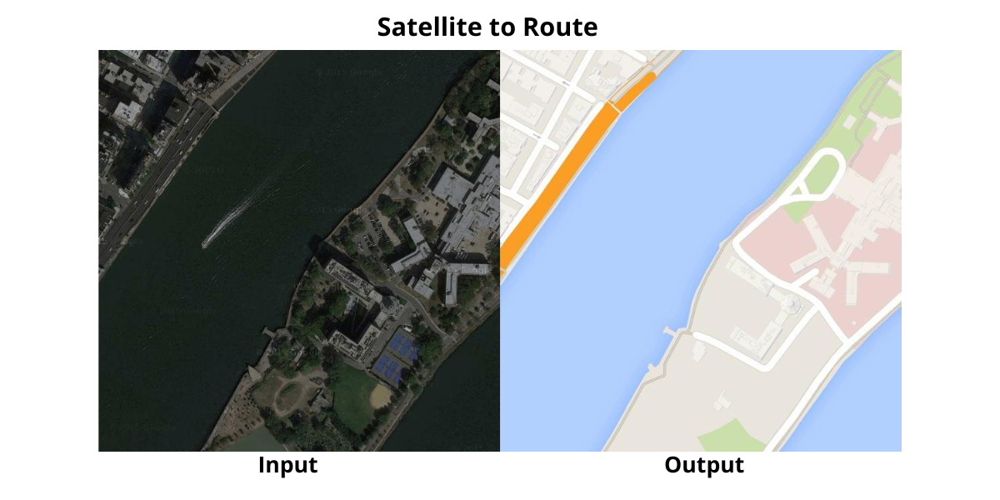
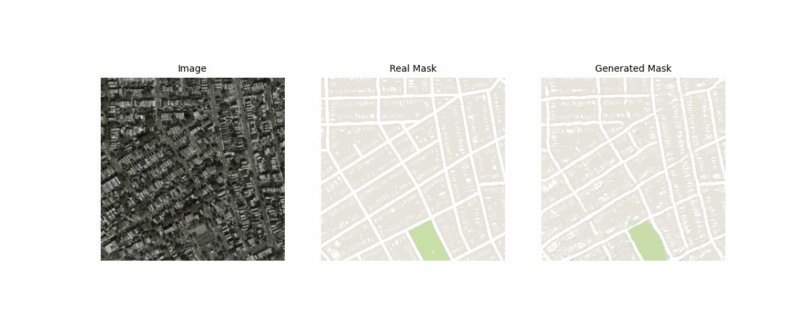

# <h1 align="center">Pix2Pix</h1>

 

<i>Source: TensorFlow</i>

This repository implements generative models inspired by the paper [*Image-to-Image Translation with Conditional Adversarial Networks*](https://arxiv.org/abs/1611.07004) by Isola et al. (2017), also known as Pix2Pix. This method offers a powerful framework for image translation tasks, enabling the direct mapping from input to output images based on paired training data. Pix2Pix has demonstrated remarkable results in various applications, including style transfer, semantic segmentation, and image synthesis.

## TensorFlow and PyTorch Implementations

To explore the capabilities of Pix2Pix, implementations were done in both TensorFlow and PyTorch, the two most widely used frameworks in Deep Learning. Each implementation provides deep insights into the differences and similarities between these frameworks, offering practical perspectives for deep learning practitioners.

- [TensorFlow Notebook](Pix2Pix_Satellite2Routes_TensorFlow.ipynb)

- [PyTorch Notebook](Pix2Pix_Satellite2Routes_Pytorch.ipynb)

## Dataset Setup

The ``Satellite2Route`` dataset was utilized, comprising directories of satellite aerial images (input) and map routes (output). Access to the dataset is available either through direct download or via access from [my Personal Drive](https://drive.google.com/drive/folders/19giwoxuUnRg0-5cB9SJS7ETY9fmuBOgd?usp=sharing).

## Key Components of Pix2Pix

Among the crucial aspects of Pix2Pix are:

- **Generator Architecture:** A generator architecture based on [U-Net](https://arxiv.org/abs/1505.04597) is implemented, renowned for its effectiveness in image generation tasks.
- **PatchGAN Discriminators:** Inspired by the [pix2pix paper](https://arxiv.org/abs/1611.07004), PatchGAN discriminators are used to evaluate the authenticity of generated images at a patch level, providing detailed feedback.

## Generated Examples

 

The generated examples and GIF of the results are located in the [images folder](images), with additional examples available in the notebooks.

## Technological Stack
 

## Contact

